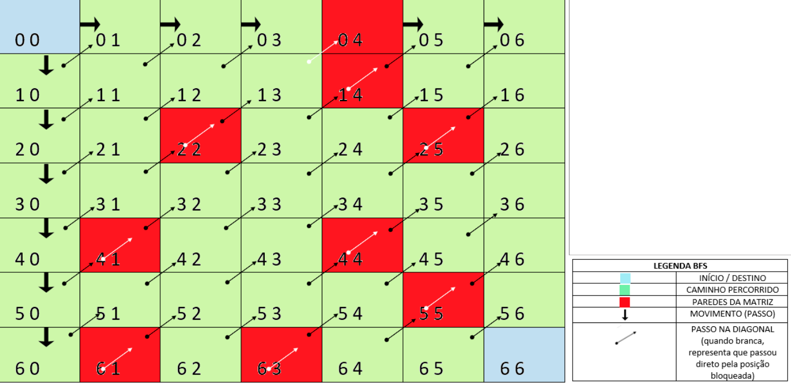

# Exercício de Tipo Abstrato de Dados Labirinto - BFS e DFS

<h1> Tipos diferentes de busca para percorrer um Labirinto

## Conteúdos

 <a href="#apresentação">Apresentação</a> •
 <a href="#representação-gráfica-dos-algoritmos-de-busca">Representação gráfica dos algoritmos de busca</a> •
 <a href="#lógica">Lógica</a> • 
 <a href="#representação-gráfica">Representação gráfica</a> • 
 <a href="#perguntas">Perguntas</a> • 
 <a href="#bibliotecas">Bibliotecas</a> •
 <a href="#compilação-e-execução">Compilação e Execução</a> • 
 <a href="#autores">Autores</a>

---

## Apresentação

Foi proposto pelo professor [Michel Pires da Silva](http://lattes.cnpq.br/1449902596670082) da matéria de `Arquitetura e Estruturas de Dados 1 do 3º Período do curso de Engenharia da Computação` no decorrer de suas aulas um problema no qual propunha um jogo em que é possível deslocar por dentro de uma determinada matriz até encontrar o *NxN* (sendo o ultímo elemento) utilizando dois tipos diferentes de algoritimo de busca, sendo eles, `BFS (Busca em Largura controlada por Fila)` e `DFS(Busca em Profundidade controlada por Pilha)`, porém possuía as seguintes regras as serem seguidas e que foram obedecidas no final da resolução da proposta:

- [X] O jogo deve ser elaborado utilizando um arquivo de configuração;
- [X] O arquivo deve possuir tamanho da matriz, posições das paredes e tipo de busca;
- [X] O jogo termina assim que for atingido o alvo (NxN);
- [X] Percorrer a matriz a partir do início;
- [X] Imprimir o caminho em tela sob representação de matriz (em caso DFS);

O algoritmo de busca `DFS` significa *Depth First Search*, sendo uma técnica que utiliza uma *Estrutura de dados Pilha* onde procura sempre explorar dando preferência a uma determinada direção a partir da posição inicial, empilhando as posições visitadas e desempilhando as posições que já foram passadas.

O algoritmo de busca `BFS` significa *Breadth First Search* e consiste em uma técnica baseada em largura onde visita um elemento e todos os seus vizinhos, depois todo os vizinhos dos vizinhos e assim por diante. Para fazer isso, o algoritimo usa uma *Estrutura de dados Fila* em que o primeiro a entrar será o primeiro a sair sendo mais lento que o `DFS`

---

## Representação gráfica dos algoritmos de busca

 

A representação mostra o início em (0x0) e os números que estão dentro das células mostram os passos percorridos até chegar ao final *@* (NxN), onde é visualizado a diferença na forma de caminhar nos dois algoritmos de busca.

 

---

## Lógica

Ao se deparar com proposta do problema citado na <a href="#apresentação">Apresentação</a> a dupla decidiu em utilizar apenas um programa principal no qual iria ler o arquivo citado nas regras de desenvolvimento do programa onde após a leitura iria ser chamado o método de busca em que era desejadO utilizar, sendo esses dois métodos implementados nesse programa principal, foi feito as inserções de uma [Fila Dinâmica](https://github.com/mpiress/dynamic_queue) e uma [Pilha Dinâmica](https://github.com/mpiress/dynamic_stack) onde foram clonadas dos respectivos repositorios para obter seus métodos básicos mantendo a proposta de cada algoritmo de busca requerido. O desenvolvimento da lógica de todo o problema foi desenvolvida em 3 sub etapas para que houvesse sucesso na resolução, sendo elas,  <a href="#•-funcionamento-da-leitura-do-arquivo">Funcionamento da leitura do arquivo </a>, <a href="#•-funcionamento-do-dfs">Funcionamento do DFS</a> e <a href="#•-funcionamento-do-bfs">Funcionamento do BFS</a>:

### • Funcionamento da leitura do arquivo

Para ser feita a leitura correta do arquivo primeiramente o nome do mesmo terá que ser `matriz` do tipo  *txt*, foi preciso pensar levando em consideração as regras propostas, resumindo então em ler o tamanho N da matriz na primeira linha utilizando a função _fscanf_ lendo apenas um número por se tratar de uma matriz quadrática sendo esse número adquirido pela variavel _tam_ para ser feita a construção da matriz alocando o seu tamanho de linhas e de colunas, após a leitura da primeira linha foi utilizado dois comandos `FOR` para que fosse possível ser feita a leitura da matriz dentro do arquivo constituindo de **zeros** (caminhos possível de se locomover) e **uns** (paredes de bloqueio) direcionando-a para o programa e armazenando-a nos espaçoes alocados sendo feito então toda a criação já da matriz com suas paredes de bloqueios. Para ser feito a leitura do tipo de método utilizado para busca foi pensando em ser feita novamente a leitura com a função _fscanf_ onde se usuário quiser utilizar o método `DFS` será necessário apenas modificar a ultima linha para **0** e caso se quiser utilizar o método `BFS`irá modificar para **1**, pois com isso o programa entenderá, a partir de um tratamento com `IFs` feito pela dupla que dependendo do valor citado seria feita a leitura desejada do método.
Exemplo de entrada do arquivo `matriz.txt`: 

 

### • Funcionamento do DFS

Para ser obtido êxito na inserção do método de busca `DFS(Busca em Profundidade controlada por Pilha)` foi encontrada uma dificuldade maior pela dupla do que para a inserção do método de busca `BFS (Busca em Largura controlada por Fila)` onde diversas vezes era encontrado um loop infinito e uma lógica falha, após diversas tentativas, foi pensado em criar uma função chamada `DFS` onde nela foi feita a inserção da *Pilha* para aplicá-la ao algoritmo, recebendo como parâmetros a matriz alocada e seu tamanho e antes de ser iniciado qualquer tipo de locomoção, foi empilhado as primeiras posições, tratando-as como __x__ (posição do eixo x) e __y__ (posição do eixo y), posições essas que no começo era *x=0* e *y=0* partindo então do ponto inicial, após isso, iniciou um comando `WHILE` que recebia como condição que fosse repetido até o último elemento se tornar 1 pois como será visto mais à frente na explicação da lógica, todas as células que foram passadas foram definidas como *1* e o último elemento sendo 1 irá dizer que chegou ao final da matriz concluído o percurso. Após a inserção do `WHILE` foi introduzido a lógica principal do programa onde trata primeiramente todos os tipos de bordas por cada uma haver uma especialidade diferente, podendo causar algum erro caso seja ignorada, começamos então tratando da primeira borda onde j é igual a 0, implementando um `IF` com a essa condição sempre priorizando para que seja feito o percurso para baixo, priorizando como profundidade, com isso o algoritmo vai verificando toda vez se o próximo de baixo da célula em que ele está situado é igual a 0 (caminho livre) e se não pertence a última linha, onde seria reportado um _segmentation fault_ caso locomovesse para baixo ultrapassando os limites da matriz, se o mesmo obedecesse todas as condições do `IF` o mesmo então locomoveria para a célula de baixo (**i++**), empilhando essa nova posição __x__ e __y__ na *Pilha* e tornando essa posição como valor 1, tornando-a inacessível e sempre que é feita alguma transição é utilizado um contador que atribui valor a variável _count_ fazendo com que no final seja possível calcular o caminho total percorrido. Caso o mesmo não consiga se locomover para baixo, sua nova prioridade será locomover para a direita (**j++**), conseguindo andar, implementaria a mesma lógica mencionada anteriormente relacionada a empilhar a posição, torna-la inacessível e aumentando o número no contador, a partir do momento em que estiver em uma posição onde fazendo todas as verificações possíveis para a primeira coluna e não encontrando nenhuma forma possível de caminhar, o algoritmo foi programado para desempilhar o último elemento empilhado através da função `POP`, torna-lo inacessível e aumentar mais uma interação no contador. Utilizando essa mesma lógica então para a borda da esquerda em que não é possível a locomoção para a direita e depois foi tratado os elementos que não pertenciam a nenhuma borda onde podem caminhar para qualquer lado sempre priorizando o caminho para baixo.
Ao final das verificações mencionadas acima é realizado a impressão de quantos interações foram necessárias para que fosse possível chegar até o final e então a impressão da matriz mostrando o caminho percorrido sendo os elementos que possuem o valor _"1"_ em sua célula.

Exemplo de saída do algoritmo `DFS` implementado pela dupla:

 

### • Funcionamento do BFS

O funcionamento do método de busca `BFS (Busca em Largura controlada por Fila) ` foi resolvido com maior facilidade, mas se tratou de um algoritmo mais trabalhoso, onde foi feito diversos pensamentos lógicos para a solução foi encontrada, creio eu, não a melhor, mas a que a dupla obteve maior facilidade de aplicar. Onde dentro dos arquivos de implementação da *Fila* foi criado uma função chamada `BFS` onde era então criada a lógica desse método e recebia como parâmetros a matriz e seu tamanho, primeiramente foi criada a fila nessa função e enfileirando a primeira posição da matriz sendo a posição inicial da locomoção através da função da fila *Enfileira*, para ser feita a locomoção foi utilizado as variáveis **i** para o número da linha e **j** para o número da coluna, com isso foi implementado um `WHILE` em que sua condição é repetir enquanto o **i** for menor que o tamanho de linhas e **j** for menor que o tamanho de colunas, caso essa condição seja atendida então chegará ao final da matriz, com isso, foi visto um padrão da seguinte forma: as células que pertenciam a primeira coluna e primeira linha, exceto a posição inicial e final, poderiam se locomover para baixo e para a direita e as demais células só poderiam se locomover para a direita, pensando nisso utilizamos um comando `IF` onde verifica se a célula está na posição inicial, caso esteja, ele irá verificar se a posição de baixo é 0 (posição válida), ele irá introduzir dentro do `IF` e a lógica irá apenas olhar aquela posição adicionando +1 no **i** (olhando literalmente seu vizinho), não irá mover seu **i** e **j** para ela, onde então vai enfileirar essa posição de baixo na fila e contar a instrução com um contador **count_caminho**, feito isso vai ser verificado a posição da direita (vizinho), por se tratar da primeira linha da primeira coluna, caso essa posição seja acessível irá enfileirar e contar a instrução também, e a partir disso  ele irá desenfileirar a posição que não será mais utilizada e só feito isso tudo que ela irá caminhar verdadeiramente para a posição de baixo (**i++**). Após essa etapa um novo problema surgiu no qual era tratar as diagonais, não apenas os vizinhos do lado e de baixo, com isso então foi feito um `IF` em que e estivesse em qualquer linha da primeira coluna (exceto a primeira linha), o mesmo iria verificar o de baixo e o da sua lateral esquerda utilizando os métodos e procedimentos citados anteriormente e somente assim que o mesmo irá se locomover para a sua diagonal  **i--** e **j++** e para limitar a quantidade de diagonais que devem ser percorridas utilizamos a seguinte lógica: observamos que a posição **j** da última diagonal daquela linha iria ter o mesmo valor que o **i** que representa a linha, então foi limitado em um `WHILE` para que parasse de andar na diagonal assim que **j** fosse igual  a **i**. Diante disso, foi feita então a seguinte aplicação para que fosse possível a locomoção da diagonal sem que haja confusão entre as variáveis e para que fosse possível voltar a posição da primeira coluna sem perder seus valores: Se fosse a primeira vez em que iria ocorrer uma locomoção diagonal as variáveis auxiliares criadas iriam receber seus respectivos valores de i e j (__aux_i = i__ e __aux_i = i__) e só assim então que elas iriam andar na diagonal como mencionado anteriormente e verificando se seus vizinhos serão vizinhos acessíveis para enfileiramento e a cada vez que um vizinho for acessível irá adicionar mais um no contador de interações e assim que fosse percorridas todas as diagonais possíveis da linha, o verdadeiro valor de i seria incrementado indo para a linha de baixo iniciando um novo processo com as mesma instruções. Ao final do programa todas as interações estarão contadas dentro da variável **count_caminho** e assim então será imprimida a mesma mostrando que foi possível sim chegar ao final por meio de locomoção em "força bruta".

Exemplo de saída do algoritmo `BFS` implementado pela dupla:

 

---

## Representação gráfica

Segue a representação gráfica de um exemplo ilustrado dos dois diferentes algoritmos de busca e suas respectivas legendas aplicadas ao exemplo de matriz fornecidos pelo professor:

 
<i><b>Matriz 1: </b>Representação apenas da matriz e suas parede de bloqueio</i>

 
<i><b>Matriz 2: </b>Representação matriz percorrida utilizando DFS</i>

 
<i><b>Matriz 3: </b>Representação matriz percorrida utilizando BFS</i>

---

## Perguntas

<i>1</i> - Sim, diferentes tamanhos de matrizes e posicionamentos de paredes irão influenciar diretamente em qual dos métodos terá uma reposta mais eficiente. Para matrizes onde o número de paredes é consideravelmente alto ou as paredes se encontram em posições as quais formam uma espécie de caminho sem volta, o BFS retornará o resultado com um tempo de execução menor. Caso contrário, para matrizes onde o número de paredes é baixo, o DFS possui melhor performance, uma vez que a probabilidade de ficar preso em um corredor é mais baixa quando há poucas paredes, por consequência, DFS dará menos passos e retornará mais rápido que o BFS. 
<i>2</i>- O DFS busca o caminho dando preferência ao comando inicial (DESCER ou IR PARA DIREITA), isso implica que, suas decisões são tomadas apenas observando o próximo passo, não é levado em consideração que,  se o algoritmo optar por descer agora ao em vês de virar a direita, ele ficará sem mais para onde ir. Isso é uma característica de uma família de algoritmos chamados de Algorítmos gulosos. Então não, os algorítmos aqui apresentdos não possuem capacidade de encontrar o menor caminho até o seu destino.

---

## Bibliotecas

Para o funcionamento do programa, é necessário incluir as seguintes bibliotecas: 
<ul>
    <li><code>#include 'stdlib.h'</code></li>
    <li><code>#include 'stdio.h'</code></li>
    <li><code>#include 'stdbool.h'</code></li>
</ul>

---

## Compilação e Execução

O programa feito de acordo com a proposta possui um arquivo Makefile que realiza todo o procedimento de compilação e execução. Para tanto, temos as seguintes diretrizes de execução:

| Comando                |  Função                                                                                           |                     
| -----------------------| ------------------------------------------------------------------------------------------------- |
|  `make clean`          | Apaga a última compilação realizada contida na pasta build                                        |
|  `make`                | Executa a compilação do programa utilizando o gcc, e o resultado vai para a pasta build           |
|  `make run`            | Executa o programa da pasta build após a realização da compilação             

---

## Autores

Criado por [Henrique Souza Fagundes](https://github.com/ohenriquesouza) em conjunto com [Pedro Henrique Louback Campos](https://github.com/PedroLouback) 

Ambos alunos do 3° periodo do curso de `Engenharia da Computação` no [CEFET-MG](https://www.cefetmg.br)